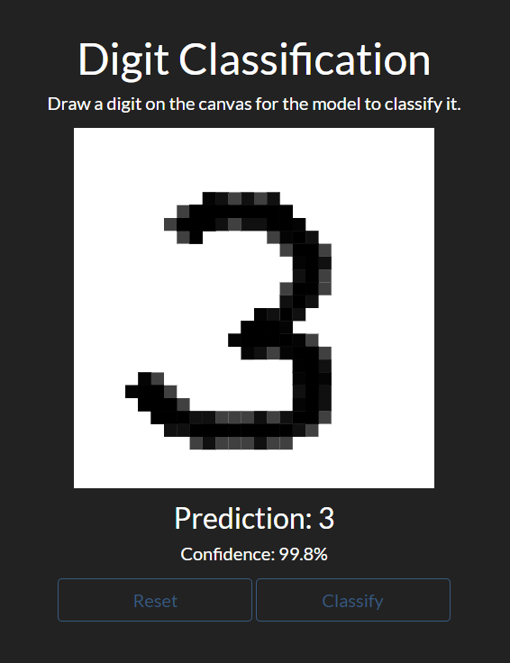

# Digit Classification

## About

Digit Classfication is a web application that classifies hand-drawn digits. A neural network created from scratch (without any external machine learning libraries) was trained on the [MNIST database](http://yann.lecun.com/exdb/mnist/) for this task.

### Built With

* [NumPy](https://numpy.org/)
* [pandas](https://pandas.pydata.org/)
* [Math.js](https://mathjs.org/)
* [Bootstrap](https://getbootstrap.com/)

## Getting Started

### Installing Dependencies

No dependencies are needed to run the web application. However, if you wish to retrain the model, [install NumPy](https://numpy.org/install/) and [install pandas](https://pandas.pydata.org/docs/getting_started/install.html).

### Retraining the Model

The `model/model_params.json` file has the model parameters for a pretrained model. However, if you wish to retrain the model, run the `model/model.py` file.

## Usage

Open the `index.html` file in a browser to launch the application. Draw a digit on the canvas and click the `Classify` button. For the best results, make sure the digit is centered on the canvas. To clear the canvas, click the `Reset` button.

## Contact

Aaryam Maheshwary - aaryam.maheshwary@gmail.com